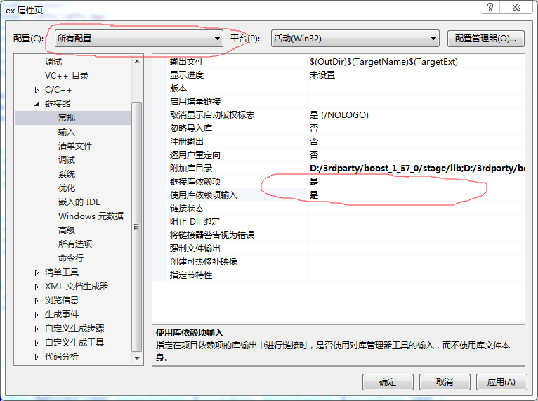

caffe-ex
========

利用 mini-caffe 在 Windows VS 开发测试 Caffe 相关项目。

### mini-caffe 安装

参考 mini-caffe 安装文档，编译生成 mini-caffe 依赖的第三方库。

### 工程配置(参考本项目)

由于目前的静态库局限性和为调试代码的方便性(顺便学习 Caffe 源码)，我们将 mini-caffe 作为工程项目的子项目(如果你做版本控制就将 mini-caffe 作为本 git 项目的子 git 项目存在，不然就直接拷贝一份到现在的工程目录下)，直接参与整个工程的构建。具体配置可参考本项目。

```
git submodule add https://github.com/luoyetx/mini-caffe.git mini-caffe
```

可以将 mini-caffe 作为当前git项目的子项目，方便后期更新 mini-caffe 的代码。

假设当前项目为 caffe-ex，我们设置源码目录树如下：

```
+ caffe-ex
|__CMakeLists.txt
|__mini-caffe
|  |__***
|  |__mini-caffe.cmake
|  |__***
|
|__ex.cpp
|__ex.hpp
|__main.cpp
|__***
```

caffe-ex 的 CMakeLists.txt 写法参考本项目。生成工程文件便可以开始开发了。

### 注意事项

MSVC 会优化静态库的静态变量(程序中没有显示的引用相关变量)，导致 Caffe 中的 Layer 动态加载机制失效，我们对 VS 做如下修改。

